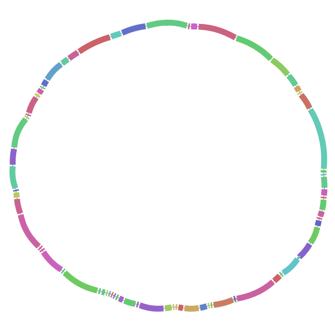

# results

For any given comparison, the pipeline produces the following results, stored in the `results/{comp_id}` folder.

## Misc files

- `graph.json` contains the pangenome graph produced by pangraph
- `seq_lengths.csv` contains the total length of the input genomes

## block information

### block statistics

The `block_stats.csv` file contains a list of all of the blocks in the graph with summary statistics:

|            | count | n. strains |    len | duplicated | core  | category   |
| :--------- | ----: | ---------: | -----: | :--------- | :---- | :--------- |
| OGIXJBTVTV |     2 |          2 | 326946 | False      | True  | core       |
| XEVNWFKICB |     2 |          2 | 224824 | False      | True  | core       |
| IRWDQBJGUJ |     2 |          2 | 224159 | False      | True  | core       |
| YTFFFPIQSD |     1 |          1 |   1418 | False      | False | accessory  |
| UZWIYCEDJP |     1 |          1 |    869 | False      | False | accessory  |
| UJFECAATVC |    23 |          2 |   1055 | True       | False | duplicated |
| NPESBINNJX |    21 |          2 |    142 | True       | False | duplicated |
| NBPXZUNQOA |    14 |          2 |   3243 | True       | False | duplicated |

- the block **count** is the total number of occurrences of the block in the two paths.
- the block **n. of strains** is the number of strains in which the block appears, either one or two.
- the block **length** is the length of the block consensus sequence.
- the **duplicated** flag indicates whether the block occurrs twice in any path.
- the **core** flag indicates block that are found exactly once in each genome.
- the **category** value can be either *core*, *accessory* (for blocks that are found only once in a path but not the other) or *duplicated*

### block start/end positions

the `block_positions.csv` file contains information on the start/end position of each block occurrence:

| genome | block_id   | strand | occurrence_number | start_position | end_position |
| ------ | ---------- | ------ | ----------------- | -------------- | ------------ |
| A      | HQBIPBHDTU | False  | 1                 | 4281140        | 4316135      |
| A      | OFBMLFJZAS | False  | 1                 | 4316135        | 4318830      |
| A      | FQSDDILWYF | False  | 1                 | 4318830        | 4319420      |
| A      | UWOHEYHMJZ | False  | 1                 | 4319420        | 4319825      |
| A      | AGYSAMGDFC | False  | 1                 | 4319825        | 4320779      |

- `genome`: on which of the two compared genomes the block occurrence is found.
- `block_id`: the unique identifier of the block.
- `strand`: indicates whether the consensus sequence of the block is on the forward (True) or reverse (False) strand.
- `occurrence_number`: the sequential numerical id associated to the particular occurrence of the block on the genome.
- `start_position`: the starting position of the block in the genome.
- `end_position`: the ending position of the block in the genome.

Notice that start < end unless the block wraps around the end of the genome

## graph export

The `export` folder contains:
- `pangraph.fa`: a fasta file with the consensus sequence for each block
- `pangraph.gfa`: a gfa file that can be opened with bandage

## dotplot

The `dotplot.html` file contains an interactive dotplot. One can select particular block of interests, or zoom on regions of interest.

## Alignments and Mutations

Alignments for core blocks are stored in `core_alignments/core_alignments`. A summary of SNPs, insertions and deletions found in these alignments can be found in `core_alignments.{snps/ins/dels}.csv`. For each mutation we report the corresponding block and the position in the block.

These are summarized in `mutations_positions.csv`, that in addition to every possible mutations also contains the position of the mutation on the genome.

## Minimal Synteny Units

The graph is very fragmented due to repeated elements. This fragmentation can be removed by extending core blocks through neighbouring duplicated regions, if the flanking regions are the same and with the same strandedness in both genomes. This effectively performs a topological paralog splitting.

The results are _Minimal Synteny Units_ (MSU), corresponding to collection of perfectly syntenic blocks.

The `msu/minimal_synteny_units.csv` file contains a table in which each block occurrence (block id, strandedness and occurrence number) is associated to a MSU (labelled with a number > 0) and a signature (random hash). Two blocks that are syntenic in the same MSU have the same synteny.
Blocks that have MSU=0 correspond to unmerged blocks, that do not have a MSU association.

The `msu/dotplot.pdf` file contains a simplified dotplot where duplicated regions that are associated to a particular MSU are collapsed. Each MSU is labelled with a number. Junctions between two neighbouring MSUs correspond to a topological difference (e.g. duplicated region with difference in copy number, inverted region, private genome...)

The `msu/alignments` folder contains full alignments for each MSUs. The length and number of SNPs, insertion and deletions in each MSU alignment are depicted in `msu/mutations.pdf` and listed in `msu/info.csv`.

