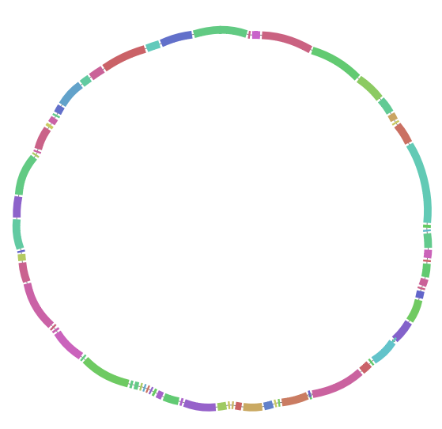

# pairwise chromosome comparison

simple pipeline for pairwise chromosome comparison

## setup

### installing the tools

- Install and activate the provided conda environment
```sh
conda env create -n paircomp --file conda_env.yml
```
- install pangraph following [the installation instructions](https://neherlab.github.io/pangraph/#Installation).

### adding the data

- add the chromosomes to compare as fasta files in `data/XXX.fa` and `data/YYY.fa`, where `XXX` and `YYY` stand for the unique file names. Each should contain *a single contig* which should have a simple id without white spaces.
- in the `comparisons` entry of the `config.yaml` file add the desired comparison:
```yaml
comparisons:
  comp_1: ["XXX", "YYY"]
```

## running the pipeline

after activating the conda environment run the pipeline with:
```sh
snakemake -c1 all
```

## output

The output of the pipeline are described in [results](notes/results.md)



## ToDo

- [x] extract alignments of all core regions
- [x] extract list of mutations: three dataframes: SNPs, insertions and deletions for core blocks.
- [x] dotplot
  - [x] add private segments on the sides (sub-plots)
  - [x] add periodic boundary conditions
- [x] block stats
- [x] core alignments
- [x] detect non-syntenic duplications by gluing the paths
  - [x] produce list of Minimal Synteny Units (MSU)
  - [x] produce MSU alignments
  - [x] produce MSU dotplots to see ambiguous regions
- [x] position in the genome for the mutations / indels
  - [x] use the block positions dataframe already created, with `(iso, block_id, block_occ)` as index.
  - [x] define a function to find location within the alignment on the sequence (add/remove indels to position).
  - [ ] check that it works for fwd/rev alignments (check 1-based indexing)
- [x] block list with positions in the two genomes
- [x] note with better description of the results